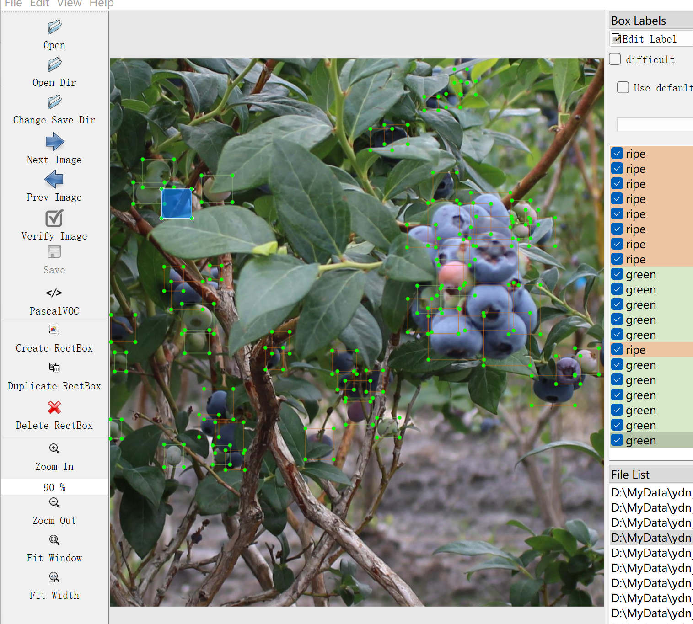

# Blueberry Maturity Detection - Target Detection Dataset

Dataset Information Introduction: The dataset consists of 455 images and corresponding annotation files.
Annotation Files: The formats include VOC-XML files in XML format and YOLO-txt files in YOLO format.
Annotation Objects: The following are the types of objects annotated: ['green', 'ripe']
Each column has information about the number of images and the number of annotation boxes as follows: (the English labels are used for annotation, and the Chinese names provided in parentheses are for reference)
Note: An image may contain multiple annotations, so the total number of annotation boxes may be greater than the number of images.
The complete dataset includes three folders and a txt file:
all_images: Stores the dataset's images, screenshots included:
all_txt and classes.txt: Stores YOLO-txt annotation files, the number of files is the same as the number of images, each annotation file is corresponding to an image.
classes.txt:
For a detailed understanding of the standard YOLO file format, please refer to your own search on Baidu. In short, the number 0 in the list represents the name at the position 0 in the array in classes.txt.
all_xml: VOC-XML annotation files. The number of files is the same as the number of images, each annotation file is corresponding to an image.
For a detailed understanding of the standard VOC-XML file format, please refer to your own search on Baidu.
Both formats of annotation can be used, choose one according to your preference.
Annotation Screenshots:

## Picture

Here is a pay link on Stripe ( https://buy.stripe.com/3cs8yP7sY87d0vu9AB ). Please contact me lonlonago@foxmail.com after funding $89, and I will send you a complete data files , thank you!

